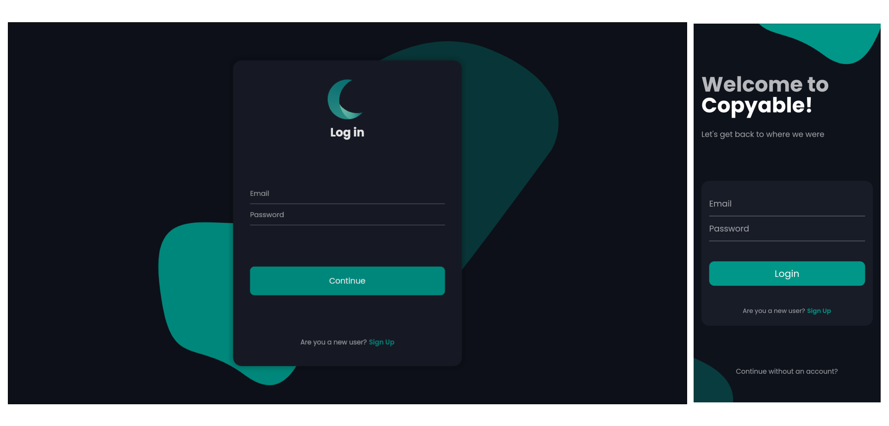
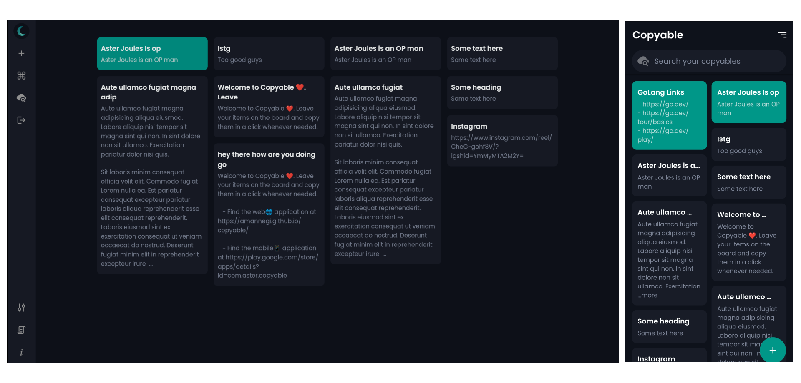
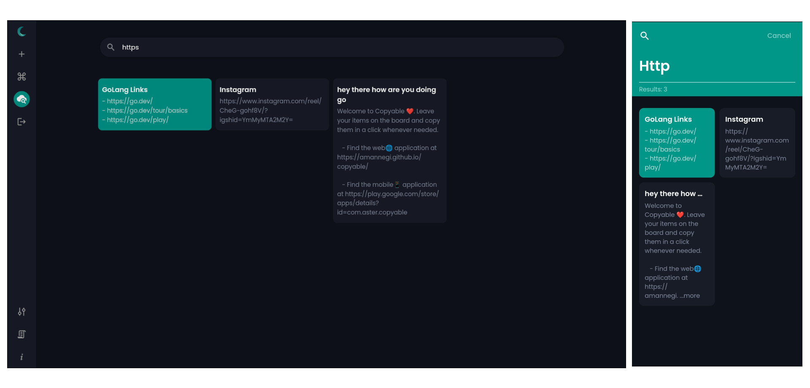
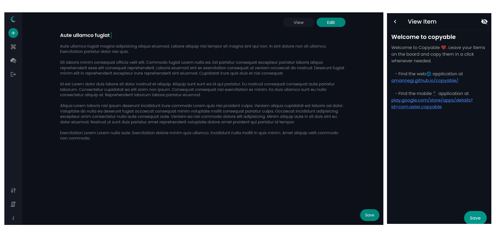
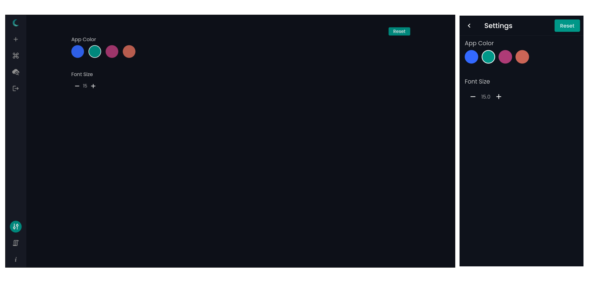

<!-- # Copyable 📋 -->

# Copyable 


</br>

An application that can be used to save some text and instantly get it when needed. This app is build for content creators, developers, designers and many more people who come across writing the same things again and again.

Some use cases are specified below:

- For a person posting on social media it's quite time taking to keep track of the tags #️⃣ he uses.
- Saving some links🔗 which can be fetched at a click.
- A company or freelancer handles multiple clients in a day, it's a time taking process to write to everyone, so it's better to save the intro text somewhere.
- Accessing some text across your devices (Mobile, Laptop, Tablet).
- This app also elimates the need for creating a **For Me🔮** group in your favourite messaging app.
- Also has the famous `lorem ipsum` text.
  </br>

> Download the **Android** app from [here](https://play.google.com/store/apps/details?id=com.aster.copyable). <br>You can visit the live ✨ web application at https://amannegi.github.io/copyable. <br> Source Code: https://github.com/amannegi/copyable.

</br>

## Features 🗺

- One Click Copy.
- Authentication powered by Firebase.
- Real time data updates across all logged in devices.
- Offline version available for mobile devices.
- View/Open links embedded in any copyable item.
- Search across your copyable items.
- Set custom font Size and color settings.
- The web application also supports keyboard shortcuts on all desktop browsers.

## Screenshots 📱💻


<p align="center" >Auth Page</div>

<p align="center" >Home Page</div>

<p align="center" >Search Page</div>

<p align="center" >Add Edit Page</div>

<p align="center" >Settings Page</div>
</br>
</br>

## Project Structure 🏢

```
...
   ├── pages/   # This folder contains all the pages.
   ├── pages/auth/   #This folder contains auth related files.
   ├── pages/home/   #This folder contains home page for Web and Mobile view.
   ├── helper/   # This folder contains helper methods and classes.
   ├── widgets/   # This folder contains reusable widgets used in the app.
   ├── widgets/   # This folder contains reusable widgets used in the app.
   ├── models/   # This folder contains data models.
   ├── data/   # This folder contains files which control the data flow across the application. Purely API intregration related files.
   ├── route_generator # Contains all the routes used in the app.
   ├── globals.dart   # Contains all globally used variables.
   ├── colors.dart   # Contains the colors used throughout the application.
   ├── strings.dart   # Long Strings used throughout the application.
   ├── secrets.dart   # Use this file to place your credentials.
   └── main.dart   # Root file of the project
```

## Authors 🧑

> [**Aman Negi(Aster Joules)**](https://github.com/AmanNegi) - _Initial work_

</br>

## Feel Free to Contact 📱

- Gmail : asterjoules@gmail.com
- Instagram : [Aster Joules](https://www.instagram.com/aster_joules/)
- My Portfolio Website : [https://amannegi.github.io/](https://amannegi.github.io/) - _In Progress_
  </br>
  </br>

## Contribute 🧑‍🤝‍🧑

- The project is at an inital stage of development thus we expect many new changes.
- If you find any potential issues you can open an issue we will try to fix it as soon as possible.
- If you want to contribute to this project, you can create a **pull request** with detailed description as to what changes you have made, and we will test and merge the pull request.
- If you face any issues setting up the project you can contact us at asterjoules@gmail.com. You can also check the steps mentioned below to check how to setup the project.

## How to setup the project ❓

1. Create a new project in your firebase console and enable firebase authentication.
2. Generate `google-services.json` file and place it in `android/app`.
3. Go to `lib/secrets` and put your credentials in the file.
4. Generate `key.jks` and place it inside `android/app`.
5. You also need to create your own `key.properties` file.

##### If you don't know how to generate `key.jks` file check [this](https://docs.flutter.dev/deployment/android)


## Licensing ©️

> Copyright 2021 Aster Joues

This is an open-source project meant for learning so it's a humble request to not sell or republish the application anywhere.

Permission is hereby granted, free of charge, to any person obtaining a copy of this software and associated documentation files (the "Software"), to deal in the Software without restriction, including without limitation the rights to use and copy, subject to the following conditions:

1. The above copyright notice and this permission notice shall be included in all copies or substantial portions of the Software.

2. No permission is granted to sell/copies of the software/codebase.

3. No permission is granted to publish/distribute the software/codebase.

4. No permission is granted to republish the same software/codebase.
